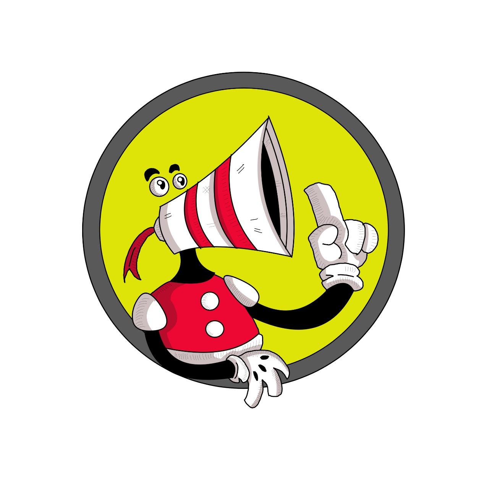

<h1 align="center">Zeladoria Virtual</h1>
Equipe: Cyber-Sul
.
  Projeto para o desafio Liga Jovem pela Sebrae.
<h2>Escopo</h2>
  Trata-se de um aplicativo de zeladoria comunitaria, onde o usuario poderia fazer um reporte de problema infraestrutural de forma simples e rapida e também ter acesso a um mapa com alocalização desses reportes.
